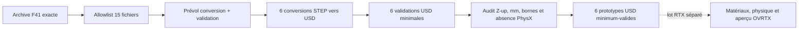

# F42a — six STEP F41 vers USD minimal

## Résultat visé

F42a est le plus petit lot Omniverse sûr après F41. Il importe les six
prototypes STEP du moteur 917/30 turbo, les convertit séquentiellement en USD,
puis applique le prévol et la validation minimale du skill NVIDIA
`omniverse-cad-to-simready`.

Ce lot **ne constitue pas** un moteur assemblé ou SimReady. Les matériaux, la
physique, les fluides, l'électricité, le rendu OVRTX, la simulation, la
fabrication et la revendication de 1 600 ch restent non exécutés ou interdits.



## Entrée immuable

Le contrat
[`component-factory-f42a-usd.json`](../twins/reference-917-engine/component-factory-f42a-usd.json)
lie l'entrée suivante :

- archive : `f41-c59-20260903t025511z.tar.gz` ;
- SHA-256 :
  `59ef86584e9dfb16481b76ce79bf5739b129ddf2d3a3869f700b2dd614bd86b5` ;
- taille compressée : `772358` octets ;
- révision productrice F41 :
  `045f41037f04b3dd69b72591d29713a17db8e1c3` ;
- payload importé : exactement `15` fichiers et `724745` octets.

Les quinze fichiers sont les six STEP, leurs six
`cad-family-report.json`, `cad-execution-report.json`, `preflight/cad.json`
et `logs/f35-cad-seed.log`. Le runner n'extrait aucun STL, 3MF, scan, photo ou
autre membre de l'archive.

Les six familles sont :

1. `connecting_rod` ;
2. `crankshaft` ;
3. `main_bearing_pair` ;
4. `piston` ;
5. `piston_pin` ;
6. `piston_ring`.

## Contrôles bloquants

Avant conversion, l'exécuteur vérifie :

- le SHA-256 et la taille de l'archive ;
- l'unicité, le type fichier régulier, la taille et le SHA-256 de chaque membre
  allowlisté ;
- la concordance des rapports famille séparés avec le rapport CAD global ;
- les six round-trips STEP valides, manifold et de volume positif ;
- le même triplet de sources F35 lié par SHA-256 ;
- l'absence de validation physique, de libération fabrication et de gate
  ouvert dans les preuves F41.

Le prévol NVIDIA est exécuté en `--check-only`, avec les seules cibles
`conversion,validation`, sans Content Agents, sans déploiement et sans mise à
jour. Chaque conversion appelle le `usd-convert-cad` empaqueté par l'adaptateur
de l'image, avec `up-axis=Z`, publication atomique et contrôle de stabilité du
STEP source. Chaque USD passe ensuite `validate-usd-minimum`.

L'audit final exige un `defaultPrim`, au moins un prim et un mesh,
`upAxis=Z`, `metersPerUnit=0.001`, des bornes conformes au rapport STEP et zéro
rigid body, collider ou joint. Il limite aussi chaque USD à 256 Mio et les six
USD à 1 Gio. Ces plafonds protègent l'exécution ; ce ne sont pas des tailles
prédites.

Le runtime de production est volontairement fermé : le contrat porte
`qualification_status=pending_new_simready_workflow_digest` et aucune
`image_ref`. L'ancien digest de la chaîne SimReady n'est pas qualifié pour ce
lot. Le wrapper s'arrête avant tout lancement Docker tant qu'un nouveau digest
public `linux/amd64`, issu de la cascade actuelle, n'a pas été contrôlé puis
inscrit explicitement dans le contrat. L'adaptateur et les cinq fichiers du
skill consommés sont également liés par SHA-256 et taille.

## Commandes

Le contrôle de l'archive est local, en lecture seule, sans Docker :

```bash
python3 twins/reference-917-engine/source/execute_component_factory_f42a_usd.py \
  inspect \
  --archive /chemin/f41-c59-20260903t025511z.tar.gz
```

L'exécution est donc actuellement **pending**. Après qualification séparée du
nouveau digest OCI et mise à jour explicite du contrat, la référence pourra être
lue sans la recopier à la main puis chargée :

```bash
F42A_IMAGE="$(python3 - <<'PY'
import json
from pathlib import Path

contract = json.loads(Path(
    "twins/reference-917-engine/component-factory-f42a-usd.json"
).read_text(encoding="utf-8"))
runtime = contract["runtime"]
if runtime["qualification_status"] != "qualified_public_linux_amd64_digest":
    raise SystemExit("runtime F42a encore en attente de qualification")
print(runtime["image_ref"])
PY
)"
docker pull "${F42A_IMAGE}"
```

Puis lancer le lot CPU depuis un dossier de sortie neuf :

```bash
bash twins/reference-917-engine/source/run_component_factory_f42a_usd.sh \
  --archive /chemin/f41-c59-20260903t025511z.tar.gz \
  --skill-root /chemin/omniverse-cad-to-simready \
  --output /chemin/917-component-factory-f42a-usd
```

Le wrapper vérifie le digest local et `linux/amd64`, puis lance le conteneur
sans réseau, sans capability, sans GPU, avec le dépôt, l'archive et le skill en
lecture seule. `NVIDIA_VISIBLE_DEVICES=void` et `CUDA_VISIBLE_DEVICES=-1`
masquent aussi explicitement tout GPU éventuellement exposé par le runtime de
l'hôte. Les tolérances d'audit des bornes sont épinglées à 1 % relatif et
0,1 mm absolu ; le contrat refuse toute valeur élargie ou non finie. Il refuse
une sortie existante.

## Artefacts attendus

```text
917-component-factory-f42a-usd/
├── f42a-input-manifest.json
├── input/f41-c59-20260903t025511z/          # 15 fichiers en 0444
├── pipeline/00_preflight/
│   ├── cad-to-simready-preflight.json
│   └── cad-to-simready-preflight.md
├── pipeline/01_conversion/<famille>/
│   ├── <famille>.usd
│   ├── conversion.json
│   ├── conversion.md
│   ├── usd-convert-cad-adapter.json
│   └── usd-convert-cad.log
├── pipeline/02_minimum/<famille>/
│   ├── validate-usd-minimum.json
│   └── validate-usd-minimum.md
├── pipeline/03_audit/<famille>/f42a-usd-family-audit.json
├── usd-execution-report.json
├── omniverse-cad-to-simready-report.json
└── omniverse-cad-to-simready-report.md
```

La taille des USD dépend de la tessellation réelle du convertisseur et n'est
donc pas inventée avant exécution. `contract_sha256`, `total_USD_size_bytes` et
le SHA-256 de chaque USD sont écrits dans le rapport final. L'entrée utile est connue
exactement (`724745` octets) ; une sortie supérieure aux plafonds est bloquée.

## Gate GPU suivant

Aucun GPU ne doit être loué pour F42a. Un lot RTX séparé ne peut démarrer
qu'après six conversions et six validations minimales réussies. Ce futur lot
pourra affecter des matériaux documentés, appliquer la physique sous contrat,
exécuter les validateurs NVIDIA plus profonds et produire l'aperçu OVRTX. Il ne
doit pas transformer ces validations logicielles en preuve de fonctionnement
du moteur ou d'aptitude à la fabrication.
