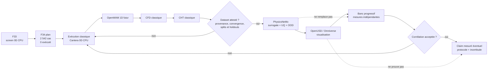

# F34 — plan DOE déterministe et sélection des surrogates PhysicsNeMo

## Résultat et frontière de preuve

F34 transforme les domaines de travail de
[F33](917_CYCLE_THERMAL_F33.md) en un **contrat de planification** séparé pour
le flat-12 atmosphérique (`NA`) et le flat-12 biturbo (`TT`). Il réserve
exactement **2 542 identités de cas**. Aucun cas n'a été exécuté, convergé,
attesté ou étiqueté ; aucun modèle n'a été entraîné.

| Objet | État F34 |
| --- | --- |
| Cas planifiés | 2 542 |
| Cas exécutés / convergés / attestés | 0 / 0 / 0 |
| Dataset apte au ML | aucun |
| Poids PhysicsNeMo | aucun |
| Résultat de banc | aucun |
| Autorisation d'entraînement | `false` |

La cible utilisateur de `1600 mechanical_hp` reste une exigence de programme,
pas une donnée d'apprentissage. Elle est interdite dans les features, labels,
transformations, critères de split et fonctions d'échantillonnage F34. Une
future puissance frein pourra être un label uniquement parce qu'elle aura été
calculée par un solveur forward accepté. F34 ne prétend donc ni atteindre ni
approcher 1 600 ch.

Le présent document est un manifeste déterministe **au niveau du plan** : il
fixe variantes, blocs, nombres, identifiants et règles de génération. Les
vecteurs numériques et résultats n'existent pas encore. Leur matérialisation
devra refuser tout espace de facteurs sans unités, bornes, version et SHA-256.

## Manifeste des 2 542 cas planifiés

Les nombres séparés par une barre sont toujours ordonnés `NA / TT`. Les deux
branches ont des frontières physiques et thermiques indépendantes ; `variant`
n'est pas une feature catégorielle commune et aucun réglage NA ne doit être
recopié silencieusement vers TT.

| Bloc | NA | TT | Total | Rôle futur | État |
| --- | ---: | ---: | ---: | --- | --- |
| Ancre F33 | 1 | 1 | 2 | reproduire le seed forward de chaque branche | non exécuté |
| Morris | 204 | 416 | 620 | screening des facteurs | non exécuté |
| LHS centrée | 512 | 1 024 | 1 536 | couverture intérieure, sans jitter | non exécuté |
| OOD réservé | 128 | 256 | 384 | test d'abstention hors enveloppe | non exécuté |
| **Total** | **845** | **1 697** | **2 542** | — | **0 exécuté** |

Le bloc Morris fixe 16 facteurs et 12 trajectoires pour NA,
`12 × (16 + 1) = 204`, et 25 facteurs et 16 trajectoires pour TT,
`16 × (25 + 1) = 416`. La liste des facteurs doit encore être versionnée ; ces
dimensions ne l'inventent pas.

Les plages d'identifiants sont réservées comme suit :

| Variante | Bloc | Identifiants |
| --- | --- | --- |
| NA | ancre | `F34-NA-ANCHOR-0001` |
| NA | Morris | `F34-NA-MORRIS-0001` à `F34-NA-MORRIS-0204` |
| NA | LHS | `F34-NA-LHS-0001` à `F34-NA-LHS-0512` |
| NA | OOD | `F34-NA-OOD-0001` à `F34-NA-OOD-0128` |
| TT | ancre | `F34-TT-ANCHOR-0001` |
| TT | Morris | `F34-TT-MORRIS-0001` à `F34-TT-MORRIS-0416` |
| TT | LHS | `F34-TT-LHS-0001` à `F34-TT-LHS-1024` |
| TT | OOD | `F34-TT-OOD-0001` à `F34-TT-OOD-0256` |

L'ordre canonique est `NA`, puis `TT` ; dans chaque branche : `ANCHOR`,
`MORRIS`, `LHS`, `OOD`, puis index croissant. Il ne dépend ni de l'ordre d'un
dictionnaire, ni du parcours du système de fichiers, ni du nombre de workers.

### Règles déterministes

1. L'ancre reprend exactement le vecteur forward F33 de sa branche, sans cible
   de puissance.
2. Morris suit l'ordre du futur `factor_space` et doit produire exactement
   204 ou 416 lignes.
3. La LHS centrée évalue le centre de chaque strate, sans tirage continu ; ses
   permutations doivent produire 512 ou 1 024 vecteurs uniques.
4. Les cas OOD dépassent au moins une borne d'entraînement tout en restant dans
   une enveloppe de calcul sûre. Ils ne peuvent entrer dans aucun split
   in-domain.
5. Chaque bloc pseudo-aléatoire dérive sa graine de
   `SHA-256("917-F34|manifest-v1|<variant>|<block>")`. La conversion des huit
   premiers octets et le générateur doivent être épinglés par version.
6. Les valeurs doivent être finies, ordonnées selon `factor_space` et
   sérialisées avec clés triées. Un SHA-256 doit couvrir en-tête, espace de
   facteurs et lignes ordonnées.
7. Une collision d'identifiant, un doublon non déclaré ou un nombre différent
   de 2 542 invalide le manifeste.

Aucun hash de manifeste n'est annoncé ici : les lignes n'ont pas encore été
matérialisées.

## Contrat d'une future ligne

Une ligne contient au plan `case_id`, `manifest_version`, `variant`,
`design_block`, `design_index`, `factor_space_ref`, `generator_ref`,
`execution_status: not_executed`, le digest du solveur,
`dataset_attested: false` et `training_eligible: false`.

Avant exécution, `solver_result_ref`, `solver_result_sha256`, `convergence` et
`labels` restent absents ou `null`. Des zéros ne remplacent jamais une valeur
inconnue. Les champs `requested_target_hp`, `target_power`,
`power_error_to_target`, `distance_to_1600_hp` et `meets_1600_hp` sont interdits
dans le contrat ML.

Les labels futurs peuvent inclure puissance/couple, IMEP/PMEP/FMEP/BMEP,
BSFC, rendement, CA10/50/90, pression maximale, états turbo, contre-pression,
débits, températures, flux et bilans. Ils ne deviennent éligibles qu'avec
unité, solveur et frontières versionnés, convergence acceptée et hash
d'artefact. Un cas divergent reste dans le ledger mais hors dataset ML.

## Exécution CPU F33, sans Vast

F34 ne justifie ni une nouvelle image multi-logiciels, ni une location Vast.ai.
La génération du plan et la première exécution 0D restent CPU et réutilisent
l'image publique immuable déjà attestée par F33 :

```text
ghcr.io/cluster2600/3dprinting993-engine-cycle-f33@sha256:287bd6ea04ff97205cbea9f63b2cc5a7c63ff754b27a183eb482e7896d1e9251
```

Le mode demeure sans réseau, en lecture seule et sous l'identité non-root
`9133:9133`. Le contrat source est
[`clean-sheet-cycle-thermal-f33.json`](../twins/reference-917-engine/clean-sheet-cycle-thermal-f33.json).
Le digest empêche qu'un changement de dépendance soit confondu avec un effet de
facteur.

Cette image reste un écran 0D non corrélé. Elle n'autorise ni OpenWAM, ni
CFD/CHT, ni entraînement. Aucun job Vast ou GPU n'est autorisé par F34 ; un GPU
ne devient pertinent qu'après attestation d'un dataset, condition actuellement
fausse.

## Choix PhysicsNeMo observé live

La découverte a été faite dans le clone absolu observé
`/tmp/physicsnemo-src`, au commit
`4fbfcfd62bf050b48ceec6b438da409b9f4644b3`. Ce chemin temporaire peut
disparaître ; les références durables sont les chemins upstream-relative
épinglés à ce commit.

### Modèles

| Rôle futur | Famille | Chemin upstream-relative | Limite actuelle |
| --- | --- | --- | --- |
| DOE tabulaire 0D | `FullyConnected` | `physicsnemo/models/mlp/fully_connected.py` | futur seulement, aucun fit |
| CFD/CHT principal | `DoMINO` | `physicsnemo/models/domino/model.py` | exige champs classiques attestés |
| Benchmark irrégulier | `GeoTransolver` | `physicsnemo/models/geotransolver/geotransolver.py` | CHT conjoint à démontrer |
| Benchmark grands nuages | `FIGConvUNet` | `physicsnemo/models/figconvnet/figconvunet.py` | pas de preuve CHT moteur conjoint |

`FullyConnected` est le baseline naturel pour de futurs tenseurs tabulaires
`(batch, in_features)`. DoMINO est le candidat principal pour géométrie et
champs surface/volume. GeoTransolver et FIGConvUNet restent des benchmarks,
pas des dépendances obligatoires.

### Datapipes

| Données futures | Composants | Chemins upstream-relative |
| --- | --- | --- |
| DOE NPZ | `NumpyReader` puis `Dataset` | `physicsnemo/datapipes/readers/numpy.py`; `physicsnemo/datapipes/dataset.py` |
| Champs DoMINO | `DoMINODataPipe` | `physicsnemo/datapipes/cae/domino_datapipe.py` |
| Maillages natifs | `DomainMeshReader` puis `MeshDataset` | `physicsnemo/datapipes/readers/mesh.py`; `physicsnemo/datapipes/mesh_dataset.py` |

Deux exemples éclairent les API sans prescrire une solution moteur :

1. `examples/cfd/darcy_physics_informed/README.md` et
   `examples/cfd/darcy_physics_informed/darcy_physics_informed_deeponet.py`
   montrent un MLP de coordonnées, mais ni FNO ni la perte Darcy ne sont
   prescrits pour le cycle 0D.
2. `examples/cfd/transient_conjugate_heat_transfer_tank_fill/README.md` et
   `examples/cfd/transient_conjugate_heat_transfer_tank_fill/train.py`
   montrent DoMINO avec géométrie et champs thermiques surface/volume. Il
   s'agit d'un réservoir, pas d'un moteur, et le dataset annoncé n'est pas
   encore public.

Ces recettes attestent seulement l'existence d'interfaces au commit observé.
Elles ne fixent ni notre schéma, ni les pertes, ni les hyperparamètres.

## Chaîne d'exécution et de preuve



Les mesures de banc restent séparées du train. Toute corrélation produit une
nouvelle version du dataset et du modèle. Ni un rendu Omniverse, ni une
prédiction PhysicsNeMo, ni le nombre de cas planifiés n'autorise un claim.

## Gates fail-closed

| Gate | Condition | État F34 |
| --- | --- | --- |
| `plan_count_exact` | 845 NA + 1 697 TT = 2 542 | défini, non matérialisé |
| `factor_space_pinned` | facteurs, unités, bornes et SHA-256 | `false` |
| `manifest_regeneration_identical` | mêmes lignes et même hash | `false` |
| `target_absent_from_ml_contract` | cible absente des features/labels | exigé, à tester |
| `classical_execution_complete` | ledger et artefacts classiques | `false` |
| `dataset_attested` | provenance, convergence, splits et OOD | `false` |
| `physicsnemo_training_authorized` | approbation distincte | `false` |
| `vast_spend_authorized` | besoin et autorisation explicites | `false` |
| `bench_claim_authorized` | mesure, protocole et incertitude | `false` |

La prochaine mutation autorisée est la matérialisation puis la validation du
manifeste. L'entraînement d'un surrogate reste interdit.
