# F42 — runtime SimReady local et transport Vast durci

F42 qualifie le **runtime logiciel** nécessaire au passage des sorties CAO F41
vers USD, OVRTX et les agents NVIDIA. Cette phase ne valide ni géométrie
moteur, ni matériaux, ni physique, ni assemblage fonctionnel, ni fabrication,
ni puissance de 1 600 ch.

## Pourquoi une republication en cascade est obligatoire

Les images historiques `e04df7…` et `f8a176…` ne sont pas autorisées pour une
nouvelle location Vast `ssh_direct`. La seconde corrige le runtime vLLM/CUDA,
mais hérite encore de clefs hôte OpenSSH produites pendant la construction de
l'image de base. Retirer ces fichiers uniquement dans une image fille les
laisserait récupérables dans la couche parente.

La correction retire donc les clefs dans le même `RUN` que l'installation
OpenSSH de `simready`, puis génère une identité éphémère au premier lancement
de `sshd`. Les appels concurrents de Vast sont sérialisés par `flock` avant de
publier un marqueur atomique. `/root/.no_auto_tmux` garantit que les commandes
SSH `BatchMode` ne sont pas interceptées par une session interactive.

```mermaid
flowchart LR
    A[simready source durcie] -->|build + smoke SSH à froid| B[Digest base]
    B -->|FROM par digest| C[simready-workflow]
    C -->|build + smoke + pull anonyme| D[Digest workflow]
    D -->|FROM par digest| E[simready-local-ai]
    E -->|build + vLLM + PhysicsNeMo + SSH| F[Digest candidat]
    F -->|wrapper OpenBao épinglé| G[Vast RTX PRO 6000 98 Go]
    G -->|SSH BatchMode + READY JSON| H[Qualification runtime]
    H -->|USD F41 seulement| I[OVRTX et agents]
```



Chaque flèche est bloquante. Un échec conserve les digests précédents dans la
liste de révocation et interdit la location suivante.

## Contrat de démarrage

Le fichier `/workspace/READY` est supprimé au début de chaque `onstart`, puis
recréé par renommage atomique seulement après :

- validation de la clef autorisée et des clefs hôte éphémères ;
- `nvidia-smi` ;
- smoke hors ligne de l'image complète ;
- smoke CUDA de PhysicsNeMo ;
- disponibilité du VLM local, de Material Agent et de Physics Agent ;
- disponibilité d'OVRTX avec `gpu_initialized=true`.

Le JSON affirme uniquement la disponibilité du runtime. Ses champs de
simulation, fabrication et puissance restent explicitement à `false`.

Le lancement payant autorisé est exclusivement
`openbao-vastai launch-simready-heavy <offer_id>`. Le wrapper relit l'offre
avant la création, impose une seule instance et utilise précisément
`~/.ssh/id_vastai` en `BatchMode`, avec un fichier `known_hosts` privé propre à
l'identifiant Vast. Il attend au maximum 30 minutes le contrat `READY` exact et
le rapport CUDA PhysicsNeMo lié au runtime. Toute divergence, interruption ou
expiration après création déclenche la destruction de cette instance et la
vérification de cinq inventaires paginés consécutifs sans son identifiant avant
de rendre l'erreur. Le label aléatoire de tentative (80 bits) est imprimé avant
le `PUT` payant afin que le superviseur parent puisse exécuter, après une sortie
anormale, `openbao-vastai reconcile-simready-attempt <label>`. Seul un reçu JSON
`OPENBAO_VASTAI_SIMREADY_CLEANUP` autorise le parent à conclure au nettoyage.

## Publication bornée

Le wrapper GitHub approuvé limite la cascade aux trois images attendues. Les
trois commandes ci-dessous ne doivent **pas** être lancées d'un bloc : entre
chacune, le digest parent qualifié est inscrit dans le `FROM` de l'enfant et
dans le verrou du wrapper, puis committé et poussé.

```bash
openbao-github publish-simready-image simready codex/917-f42-simready-runtime
openbao-github publish-simready-image simready-workflow codex/917-f42-simready-runtime
openbao-github publish-simready-image simready-local-ai codex/917-f42-simready-runtime
```

Les publications sont séquentielles : le digest parent est relevé, contrôlé et
épinglé avant de construire l'enfant. Aucun tag `latest` ne constitue une
preuve de qualification ; le lancement utilise exclusivement un digest
`sha256` explicite.

### Incident de publication du 3 septembre 2026

Le run GitHub Actions
[`33712820284`](https://github.com/cluster2600/3dprinting993/actions/runs/33712820284)
a construit et publié le candidat base
`sha256:0420c9fde0d8bb261c45a3f98ddd37e8c8fe005316758daa3feb0de1d1bf53da`,
mais le contrôle anonyme a correctement refusé sa promotion. Le pull anonyme et
les imports principaux ont réussi ; le smoke a ensuite détecté l'absence des
deux exécutables `simready-profile-validate` et `simready-nvidia-auth-check`
dans l'image de base. Le Dockerfile copie désormais ces exécutables et le test
statique protège leurs copies ainsi que leurs permissions. Ce digest échoué
reste un artefact de diagnostic et n'est ni qualifié, ni épinglé, ni utilisable
sur Vast.

## Dimensionnement de la première qualification

Le contrat actuel sélectionne une seule `RTX PRO 6000 WS` entière, au moins
80 Go de VRAM (les offres relues exposent environ 98 Go), 24 cœurs CPU, 128 Go
de RAM et 500 Go de disque. Cette classe suffit au VLM 7B embarqué, à OVRTX et
à PhysicsNeMo pour la qualification. Une H100/H200 n'est justifiée que par une
mesure de saturation ou par un calcul CAE ultérieur, pas par le nom du projet.

## Gates

| Gate | État avant qualification Vast |
|---|---|
| Base sans clef hôte publiée | republication requise après échec contrôlé |
| Concurrence `sshd` testée à froid | bloquée jusqu'au prochain smoke |
| Image finale accessible anonymement par digest | bloquée par la cascade |
| SSH `BatchMode` réel | non exécuté |
| Services NVIDIA locaux | non exécutés sur le nouveau digest |
| USD F41 validé | non exécuté |
| Simulation physique corrélée | faux |
| Moteur fonctionnel | faux |
| 1 600 ch validés | faux |
| Fabrication autorisée | faux |
