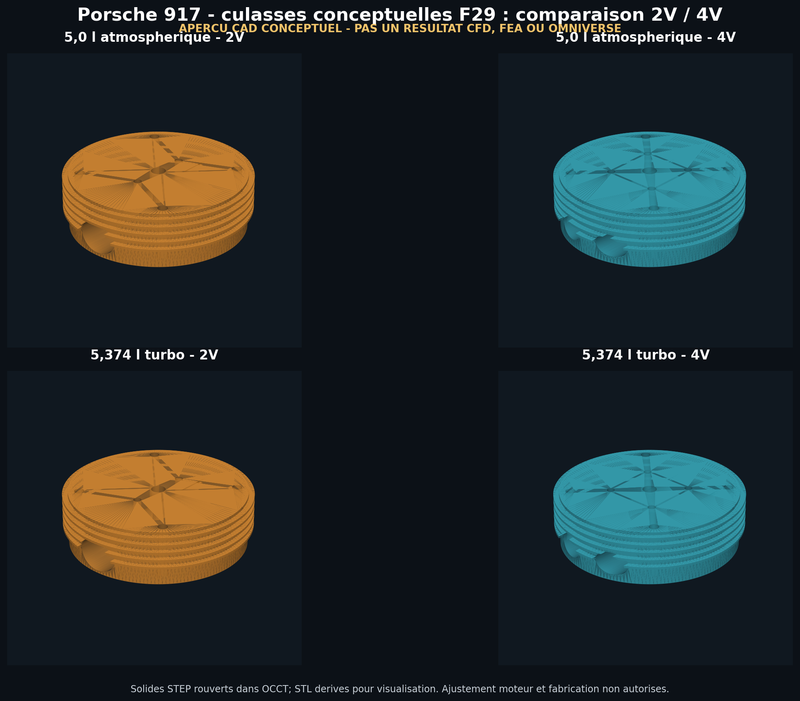
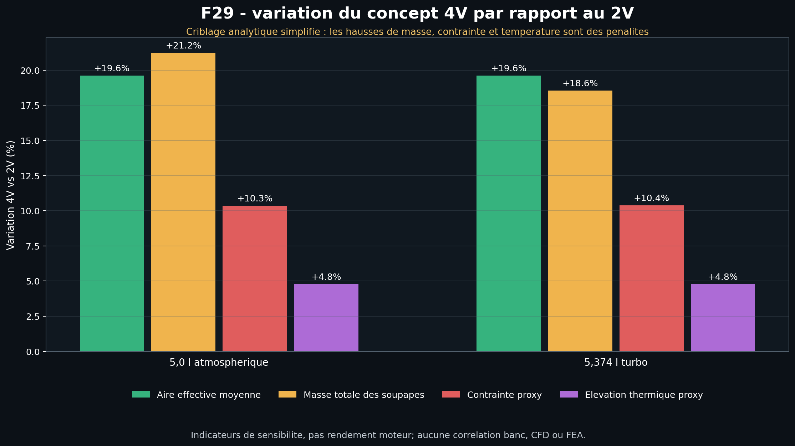

# Preuves F29 — culasse 917 conceptuelle 2V/4V

Ce dossier publie l'instantané reproductible de l'étude F29. Il contient quatre
concepts de culasse issus d'une feuille blanche, appliqués aux scénarios
atmosphérique et turbo. Il ne contient aucune géométrie mesurée de culasse
Porsche 917 et ne constitue pas un jumeau numérique validé.

## Contenu

- `design-study.json` : criblage analytique 2V/4V et hypothèses ;
- `cad/geometry-report.json` : contrôle de création et de réouverture STEP ;
- `cad/*.step` : quatre maîtres CAO neutres conceptuels ;
- `cad/*.stl` : dérivés destinés à la visualisation et au maillage ;
- `omniverse/preflight.*` : préflight local bloqué ;
- `vast/*.json` : instance distante jamais prête, puis détruite ;
- `validation-report.json` : consolidation SHA-256 fail-closed ;
- `figures/*.png` : aperçus CAD et graphique analytique reproductibles.





Les images ci-dessus ne sont pas des rendus Omniverse et ne représentent aucun
champ CFD ou FEA. Le graphique compare des indicateurs de sensibilité ; ce n'est
pas une mesure de rendement moteur.

Les chemins absolus du rapport de préflight ont été remplacés par
`${PROJECT_ROOT}` et `${PHYSICAL_AI_SKILL_HOME}` avant publication. Le statut,
les contrôles et les erreurs restent inchangés ; le rapport local brut n'est pas
commité.

## Limites de preuve

- ajustement au moteur 917 : non vérifié ;
- géométrie interne, refroidissement et interfaces mesurées : absents ;
- USD/SimReady/PhysX : non produit ;
- CFD, thermique conjuguée et FEA : non exécutées ;
- corrélation banc et fatigue : absentes ;
- impression métal, montage et démarrage moteur : non autorisés.

Reproduire la CAO et les figures :

```bash
make 917-clean-sheet-head-f29
make 917-clean-sheet-head-f29-figures
```

La validation locale complète nécessite aussi un rapport de préflight
Omniverse explicite, même bloqué :

```bash
make 917-clean-sheet-head-f29-check
```
