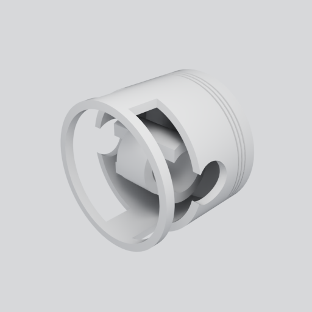

# F41 — pilote SimReady assaini du piston

Cette enveloppe conserve uniquement une preuve visuelle et un résumé compact du
pilote SimReady exécuté sur un piston de recherche local préparé pour qualifier
le parcours F41. Elle ne constitue pas une preuve d'exécution distante de la
fabrique F41. Le fichier
USD source, les USD produits par les agents, leurs prédictions et les propriétés
physiques inférées ne sont pas publiés ici.

## Résultat borné

- la lecture USD minimale a réussi : 10 prims, 2 meshes, axe Z, unité de
  `0,001 m` et aucune dépendance non résolue ;
- Material Agent a exécuté ses étapes, mais la couverture stricte n'est que de
  50 % : un mesh sur deux reste sans matériau exploitable. Le gris visible est
  donc un **proxy visuel**, pas une spécification de matière ;
- Physics Agent a terminé techniquement, mais ses masses, densités, frottements
  et restitution ont été inventés par le modèle. Ces valeurs sont rejetées et
  aucun de ses USD n'est conservé dans le dépôt ;
- l'inférence de profil SimReady a échoué faute de métadonnées. Le contrôle
  explicite `Prop-Robotics-Physx 2.1.0` échoue aussi sur les métadonnées, les
  unités attendues par ce profil, la structure de nommage et l'absence de
  vecteur de préhension. Ce dernier critère confirme qu'un profil automobile
  dédié doit être choisi ou défini au lieu d'adopter aveuglément un profil
  robotique ;
- le rendu final OVRTX en path tracing, 512 × 512 et 128 mises à jour capteur a
  produit un PNG valide.

## Contexte d'exécution

Le pilote a utilisé l'ancienne image immuable :

`ghcr.io/cluster2600/3dprinting993-simready-local-ai@sha256:e04df7b05298d318bb0ae4ca79684ca07e0f68c8802d1a0be4deb6981ff8e8c2`

Cette image n'avait pas produit `/workspace/READY`. Le chemin des bibliothèques
CUDA et l'argument JSON de vLLM ont été corrigés uniquement dans le runtime pour
qualifier les services. Cette réussite ne qualifie donc pas l'image immuable.

L'instance Vast.ai `49683839` a été détruite après récupération. Son absence de
la liste d'instances a été vérifiée le `2026-09-02T21:48:46Z` par le wrapper
OpenBao approuvé. Cette constatation ne concerne aucune autre instance.

## Provenance publiée

- rapport complet local non publié : SHA-256
  `4dcf967b9ba4237e5bd88af3c5242b90ad84391b35a8ee8cd020cf8d390cf9a6` ;
- PNG publié : SHA-256
  `e32abccfff8f7564f3c52ee2cdd57f176f86348873ab2f17c638afb73ae1697c` ;
- résumé canonique : `summary.json`.

Cette preuve ne contient ni scan brut, ni entrée privée, ni secret, ni USD
enrichi. Elle ne démontre aucune corrélation dimensionnelle ou physique, aucune
matière, aucune fabricabilité, aucun démarrage moteur et aucune puissance de
1 600 ch. Toutes ces gates restent fermées.
