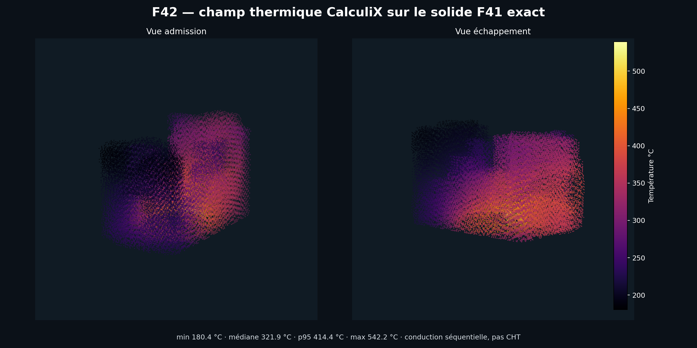

# Preuves F42 — refroidissement/CHT

Ce dossier contient uniquement des sorties dérivées de calculs exécutés :

- `f42-cooling-cht-cross-check.json` : provenance, résultats, échecs solveur et
  portes fail-closed ;
- `917-head-f42-cooling-results.png` : h, Δp et températures issus du rapport ;
- `917-head-f42-calculix-temperature-field.png` : 99 391 températures nodales
  CalculiX sur le voxel solide F41 exact.

Les fichiers locaux de maillage et de solveur ne sont pas publiés : le STL est
dérivé du scan et reste soumis à la politique `local_only`. Le rapport fixe son
SHA-256 et ceux des journaux locaux. Le canal OpenFOAM F38 publié sert seulement
de proxy quantitatif, car les trois tentatives F41 n'ont pas convergé.

Verdict : h interméthode passe, Δp interméthode et température échouent. La CHT
complète, la validation physique, l'autorisation d'impression et le démarrage
moteur restent `false`.
