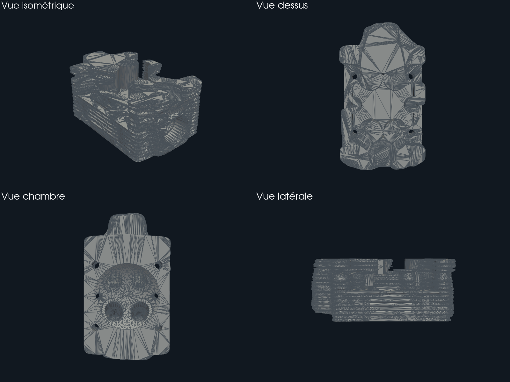

# F42 — validation Omniverse/USD de la culasse F41

Cette image est un rendu CPU de contrôle, pas une carte de solveur. Elle montre
la géométrie privée F41 convertie en USD après soudure exacte des sommets de
couture. La soudure ne déplace aucun point. Le fichier USD et la CAO privée ne
sont pas publiés.

## Résultat borné

- le prévol officiel NVIDIA est `ready` pour conversion et validation ;
- le contrôle USD minimal, les validateurs asset, géométrie et schéma physique
  réussissent sans erreur ;
- le contrôle physique certifie seulement l'intégrité du schéma USD : l'actif
  ne contient encore ni collider, ni rigid body, ni matériau physique ;
- le routeur officiel CAD vers USD s'arrête avant publication parce que le nom
  de prim généré par le convertisseur ne correspond pas au namespace canonique
  attendu par l'adaptateur ;
- le profil `Prop-Robotics-Neutral 1.0.0` échoue, aucun profil n'étant disponible
  dans le runtime ;
- le rendu natif OVRTX est bloqué par le pilote Vulkan de l'hôte. CUDA reste
  disponible, mais cela ne remplace pas une exécution OVRTX.

Le statut global est donc `needs_rerun`. Cette étape ne valide ni matière, ni
température, ni résistance, ni fabricabilité LPBF, ni démarrage moteur.

Les rapports bruts contiennent des chemins privés et restent hors du dépôt. Le
résumé assaini conserve leurs SHA-256 dans
`f42-omniverse-validation-summary.json`.
