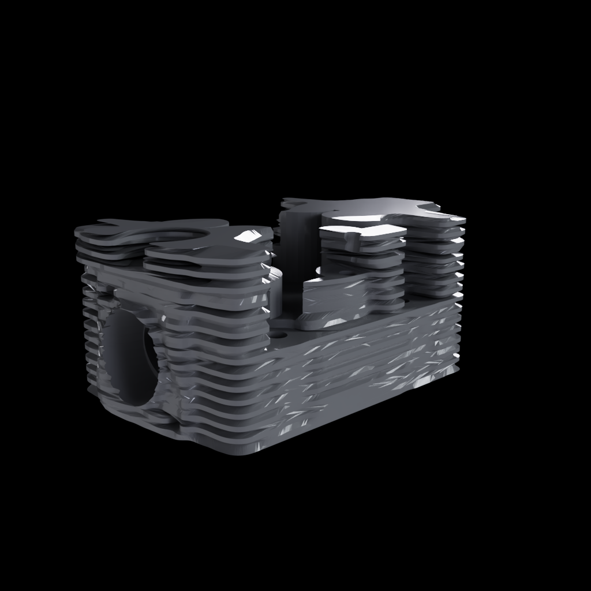
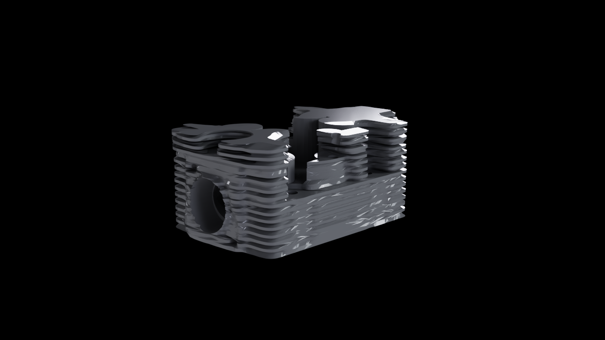
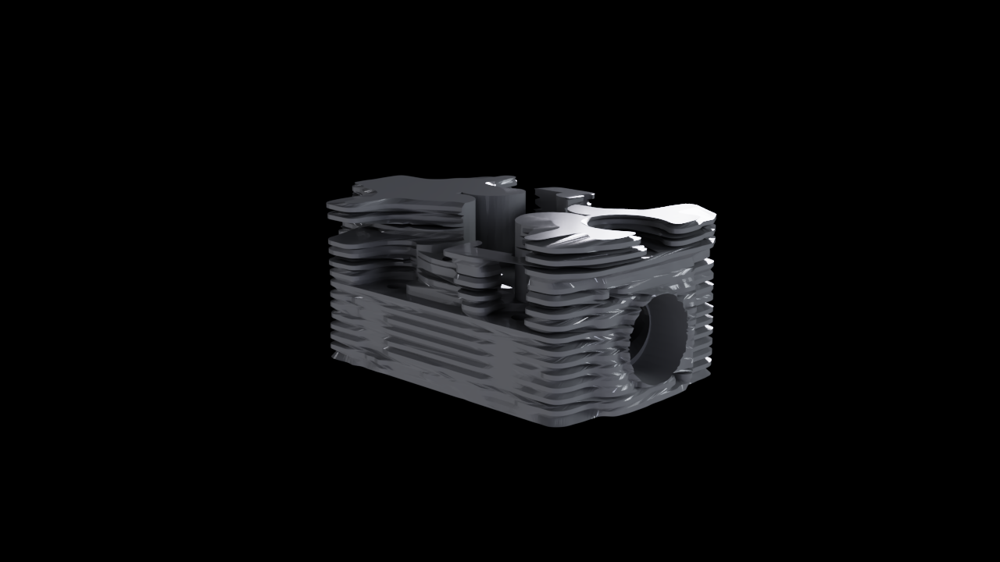
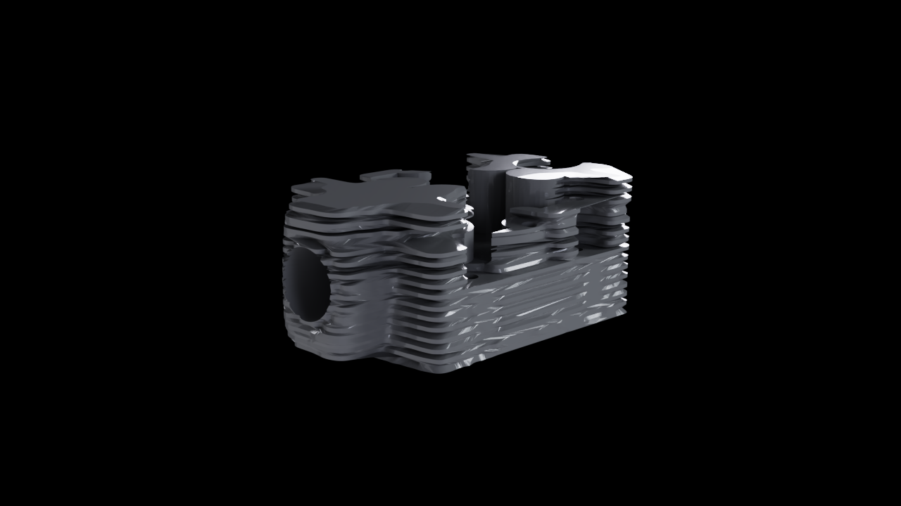
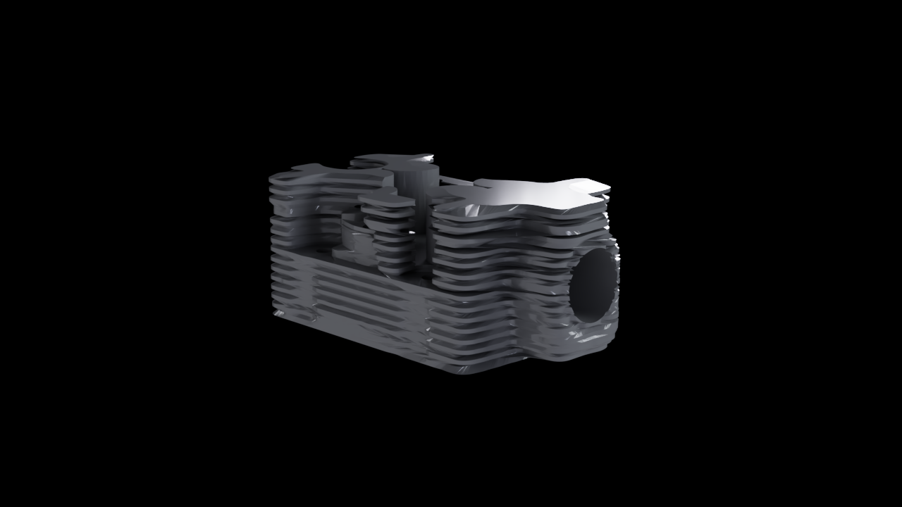

# F42 — validation Omniverse/USD de la culasse F41

[Voir le turntable Omniverse H.264](917-head-f41-welded-ovrtx-turntable.mp4)

Ce rendu provient du service NVIDIA OVRTX exécuté sur une RTX PRO 6000
Blackwell 96 Go. Il montre la géométrie privée F41 après indexation exacte du
STL soudé : aucune coordonnée n'est lissée, réparée, mise à l'échelle ou
déplacée par cette conversion. Le STL, l'USD et la CAO privée ne sont pas
publiés.

## Contrôles sur l'actif rendu

- 34 313 points, 68 678 triangles et 103 017 arêtes uniques ;
- 0 arête de bord et 0 arête non-manifold ;
- déplacement de coordonnées : 0 ;
- USD minimal : `PASS` ;
- validateurs NVIDIA asset, géométrie et schéma physique : `PASS`, 0 issue ;
- rendu principal OVRTX : `PASS`, image non uniforme ;
- turntable OVRTX : 24/24 frames non uniformes ;
- MP4 : H.264, YUV420p, 1 280 × 720, 24 frames, 3 s.

## Vues cardinales

| Avant | Droite |
|---|---|
|  |  |
| Arrière | Gauche |
|  |  |

## Limite de portée

OVRTX valide ici la lisibilité et le rendu de l'actif USD. Le validateur
physique certifie seulement l'intégrité du schéma : aucun matériau physique,
collider ou corps rigide n'est encore assigné. Le film est une rotation de
contrôle, pas une simulation de fonctionnement, de CFD, de thermique, de FEA
ou d'impression.

Le routeur CAD officiel reste en échec sur son namespace de prim et le profil
`Prop-Robotics-Neutral 1.0.0` reste absent. Le statut global est donc
`needs_rerun`; aucune autorisation d'impression ou de démarrage moteur n'est
ouverte.

Les rapports bruts contiennent des chemins privés et restent hors du dépôt. Le
résumé assaini conserve leurs résultats et SHA-256 dans
`f42-omniverse-validation-summary.json`. Le rendu CPU historique reste conservé
comme comparaison, mais ne constitue plus la preuve principale.
